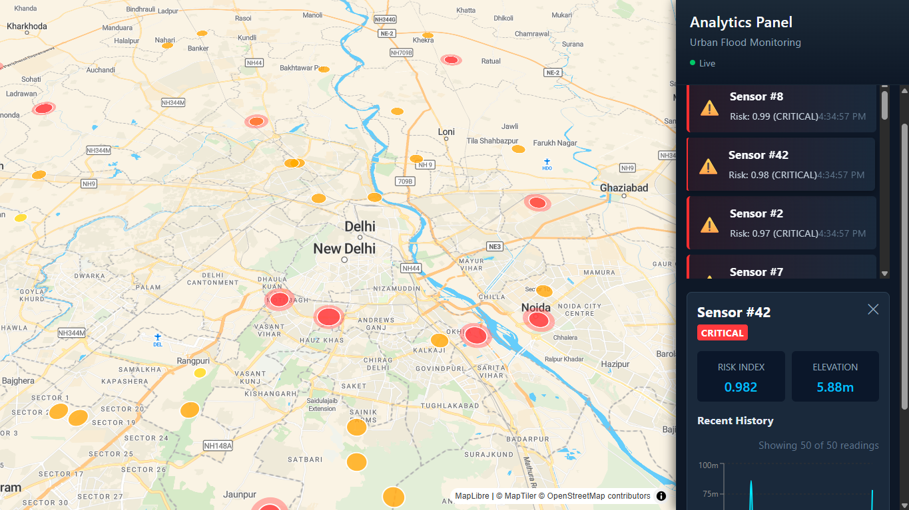

# 🌊 Jal-Prahari

**Jal-Prahari** ("Water Sentinel") is a GIS-based digital twin platform for urban flood monitoring. It simulates a network of IoT water-level sensors across a city, visualizes them on an interactive live map, and generates real-time flood-risk predictions using a rule-based heuristic engine — all streamed to a React dashboard over WebSockets.

The project is built as an end-to-end reference architecture: sensor simulation → ingestion API → PostGIS-backed storage → risk scoring → real-time delivery → map-based visualization.



---

## ✨ Features

- **Live sensor map** — MapLibre GL-powered visualization of sensor locations and risk clusters, color-coded by severity.
- **Real-time updates** — A WebSocket channel (`/ws/risk`) broadcasts fresh risk predictions every few seconds, with automatic reconnection and HTTP-polling fallback if the socket drops.
- **Flood-risk heuristic engine** — Combines current water level, recent trend, and DEM-derived elevation into a normalized risk index (`LOW` → `MODERATE` → `HIGH` → `CRITICAL`). Designed with a clean abstraction boundary so the heuristic can later be swapped for a trained ML model without touching the API layer.
- **DEM elevation lookups** — Reads Digital Elevation Model GeoTIFFs via `rasterio`, with on-the-fly CRS transformation (WGS84 → raster-native) and windowed reads for low memory overhead.
- **Sensor simulator** — An async load generator (`data-layer/`) that spins up many concurrent virtual IoT sensors and streams synthetic water-level telemetry to the ingestion API.
- **Time-series sensor history** — Historical water-level charts per sensor, backed by indexed PostGIS time-series queries.
- **Spatial database** — PostgreSQL + PostGIS schema with `Sensor` and `WaterLog` models, GiST spatial indexing, and composite time-series indexes.
- **Production-ready deployment config** — Pre-wired for a free-tier deployment on Railway (backend + PostGIS) and Vercel (frontend), with environment-driven CORS and API base URLs.

---

## 🏗️ Architecture

```
┌──────────────────┐      HTTP POST        ┌───────────────────┐
│  Sensor Simulator │ ───────────────────▶ │   FastAPI Backend  │
│  (data-layer/)    │   /api/v1/telemetry   │   (backend/)        │
└──────────────────┘                       └─────────┬──────────┘
                                                       │
                              ┌────────────────────────┼───────────────────────┐
                              │                        │                       │
                       PostGIS / PostgreSQL     DEM elevation lookup    Risk heuristic engine
                     (Sensor, WaterLog tables)      (rasterio)         (water level + elevation)
                              │                        │                       │
                              └────────────────────────┴───────────────────────┘
                                                       │
                                          REST (/api/predict/risk)
                                          WebSocket (/ws/risk)
                                                       │
                                                       ▼
                                          ┌─────────────────────────┐
                                          │   React + MapLibre GL    │
                                          │   Dashboard (frontend/)  │
                                          └─────────────────────────┘
```

---

## 🧰 Tech Stack

**Backend**
- [FastAPI](https://fastapi.tiangolo.com/) — async web framework
- [SQLAlchemy 2.x](https://www.sqlalchemy.org/) + [GeoAlchemy2](https://geoalchemy-2.readthedocs.io/) — ORM with PostGIS spatial types
- [PostgreSQL](https://www.postgresql.org/) + [PostGIS](https://postgis.net/) — spatial database
- [asyncpg](https://github.com/MagicStack/asyncpg) / `psycopg2-binary` — database drivers
- [rasterio](https://rasterio.readthedocs.io/) + [pyproj](https://pyproj4.github.io/pyproj/) — DEM/GeoTIFF elevation processing
- [Pydantic v2](https://docs.pydantic.dev/) — request/response validation
- [httpx](https://www.python-httpx.org/) — async HTTP client (used by the simulator and tests)

**Frontend**
- [React 19](https://react.dev/) + [Vite](https://vitejs.dev/)
- [MapLibre GL JS](https://maplibre.org/) — interactive map rendering
- [Recharts](https://recharts.org/) — sensor history time-series charts

**Infrastructure**
- [Railway](https://railway.app/) — backend + PostGIS hosting
- [Vercel](https://vercel.com/) — frontend hosting
- [Docker Compose](https://docs.docker.com/compose/) — local PostGIS instance

---

## 📂 Project Structure

```
Jal-Prahari/
├── backend/                 # FastAPI application
│   ├── app/
│   │   ├── api/             # Routes: sensors, logs, prediction, ingestion, websocket
│   │   ├── core/            # Config, logging, DEM parser, risk calculator
│   │   ├── database/        # SQLAlchemy models, session management, init
│   │   ├── schemas/         # Pydantic request/response models
│   │   ├── services/        # Business logic layer
│   │   └── main.py          # App entrypoint, lifespan, middleware
│   ├── tests/                # Pytest test suite
│   ├── railway.toml          # Railway deployment config
│   └── requirements.txt
├── frontend/                 # React + Vite SPA
│   ├── src/
│   │   ├── components/       # Map, sidebar, alerts, charts, etc.
│   │   ├── hooks/             # useRiskSocket, useRiskClusters, useRiskAlerts
│   │   ├── services/          # API client functions
│   │   └── context/            # SensorContext
│   └── vercel.json             # Vercel deployment config
├── data-layer/                 # Sensor simulator & load testing
│   ├── simulator/               # Async IoT sensor simulator
│   └── serializers/              # Payload schemas & batch processing
└── docker-compose.yml             # Local PostGIS container
```

---

## 🚀 Getting Started

### Prerequisites
- Python 3.11+
- Node.js 18+
- Docker (for local PostGIS) — or your own PostgreSQL + PostGIS instance

### 1. Clone and configure environment variables

```bash
git clone https://github.com/Eccentric-Ayush/Jal-Prahari.git
cd Jal-Prahari
cp .env.example .env
cp backend/.env.production.example backend/.env   # for local dev, adjust values as needed
cp frontend/.env.example frontend/.env
```

### 2. Start PostGIS locally

```bash
docker-compose up -d
```

### 3. Run the backend

```bash
cd backend
pip install -r requirements.txt
uvicorn app.main:app --reload
```

The API will be available at `http://localhost:8000`, with interactive docs at `http://localhost:8000/docs`.

### 4. Run the frontend

```bash
cd frontend
npm install
npm run dev
```

The dashboard will be available at `http://localhost:5173`.

### 5. (Optional) Run the sensor simulator

```bash
cd data-layer
pip install -r requirements.txt
python -m simulator.sensor_simulator
```

This streams synthetic telemetry to the backend so the dashboard has live data to display.

---

## ☁️ Deployment

This repo is pre-configured for a **free-tier deployment**:

- **Backend + Database** → [Railway](https://railway.app/) (FastAPI + PostGIS-enabled PostgreSQL)
- **Frontend** → [Vercel](https://vercel.com/) (Vite/React SPA)

Key environment variables:

| Variable | Where | Purpose |
|---|---|---|
| `DATABASE_URL` | Railway | Auto-injected PostgreSQL connection string |
| `ALLOWED_ORIGINS` | Railway | Comma-separated list of allowed frontend origins (CORS) |
| `VITE_API_BASE_URL` | Vercel | Backend URL used to prefix API/WebSocket requests |
| `VITE_MAPTILER_KEY` | Vercel | MapTiler API key for map tile rendering |

See `backend/.env.production.example` and `frontend/.env.production.example` for full templates.

---

## ⚠️ A Note on Risk Predictions

The flood-risk scoring in `risk_calculator.py` is a **v1 rule-based heuristic** — it combines current water level, recent trend, and DEM elevation into a normalized score. These thresholds and weights are **unvalidated starting assumptions**, not calibrated against real historical flood data. Outputs should be treated as **simulation results for platform development and visualization**, not as ground-truth life-safety predictions. The module is intentionally structured with a clean abstraction boundary so it can later be replaced with a trained ML model (e.g. Random Forest, LSTM) without changing the API or service layer.

---

## 🧪 Testing

```bash
cd backend
pip install -r requirements-dev.txt
pytest
```

---

## 📄 License

No license file is currently present in this repository. Add one (e.g. MIT, Apache 2.0) if you intend for others to reuse this code.

---

## 🏷️ Tags

`gis` `fastapi` `react` `postgresql` `postgis` `maplibre` `digital-twin` `flood-monitoring`
